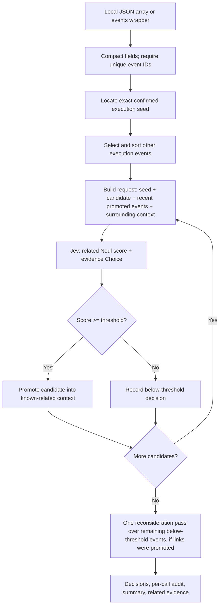
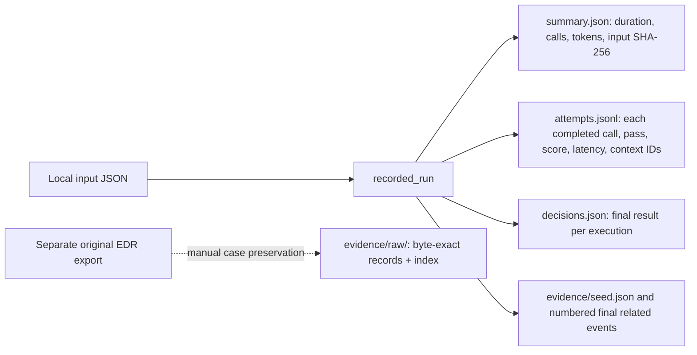
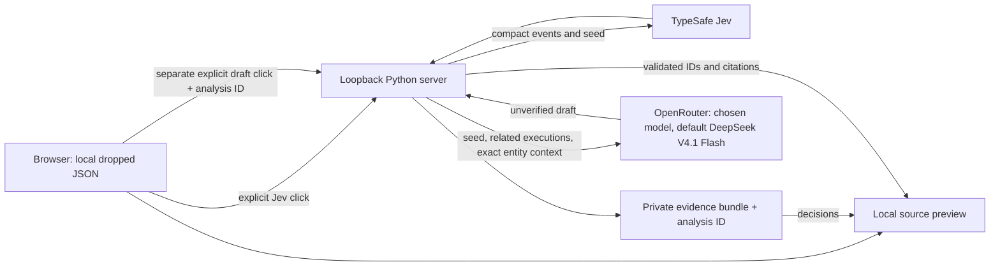

# Jev incident-correlation POC: architecture and evidence

**Status:** experimental local-input prototype. This document describes `jev_incident.py` as implemented, not an operational Elasticsearch detector. Never commit credentials, run outputs or telemetry you are not authorized to publish. See the [README](README.md) for setup and the quick start.

## What it answers

Given an analyst-confirmed malicious **execution event** and a finite local JSON event set, ask Jev whether each other execution belongs to the *same incident*. Relatedness is not a verdict that each executable is independently malicious. The user-confirmed seed is always related by definition; its `1.0` is not a model prediction. The default `0.8` threshold is an experimental promotion rule, not calibrated accuracy. Below-threshold means insufficient evidence to link under this rule, **not** benign.

## Current flow



The engine is sequential. A promoted candidate becomes available to **later** requests; it does not rewrite earlier Jev answers. After a first pass with at least one newly promoted candidate, it re-evaluates the remaining below-threshold candidates once with the expanded context. It can promote candidates on that second pass but does not perform a third pass. The second pass currently revisits *all* remaining negatives, not only those with newly relevant evidence. See `run()` in `jev_incident.py`.

### Progressive context, using actual case IDs

```mermaid
sequenceDiagram
    participant A as Analyst
    participant P as POC
    participant J as Jev API
    A->>P: Confirm 2.8.exe, event OewSb4EIkLQofmz++++4MFaH
    P->>J: seed + candidate ejlunwg0.exe + surrounding; known_related=[]
    J-->>P: related=0.94, evidence=lineage
    P->>P: Promote ejlunwg0.exe
    P->>J: seed + candidate oqqecyex.exe + surrounding; known_related=[ejlunwg0.exe]
    J-->>P: related=0.97, evidence=lineage
    P->>P: Promote oqqecyex.exe
    P->>J: seed + next candidate + surrounding; known_related=[ejlunwg0.exe, oqqecyex.exe]
    J-->>P: Score and selected category, not free-text explanation
```

The seed remains a separate `seed` member on **every** request. `known_related` contains at most the **six most recently promoted** executions, not all historical positives. `surrounding` contains at most **eight** other same-host events ranked by absolute time difference. It is independently selected from the **whole local input**, may contain as-yet-unjudged or future events, and is **not itself a promoted/confirmed list**. The score may rise or fall with new context. We have not measured whether progressive context improves correctness versus seed-only on adjudicated data.

### Exact request and decision shape

The request to `https://api.typesafe.ai/v1/systemone` is a JSON object with `model`, `state`, and `questions`. The `state` contains `seed_description`, compact `seed`, compact `candidate`, `known_related` (up to six), and `surrounding` (up to eight). The `related` question is a Jev **Noul** value between 0 and 1; the `evidence` question is a **Choice** from `lineage`, `interaction`, `artifact`, `user_host_time`, or `no_link`. The code rejects scores outside `[0, 1]` and unknown choices, then applies the threshold to the Noul value. The Choice is a **selected category**, not a generated narrative or a verified causal proof. Model is `jev-1.13.0` by CLI default and can be overridden. The script makes a live HTTPS request for each evaluation and sets a 30-second request timeout. Temporary failures (HTTP 5xx and timeouts) are retried at most twice, after 1 s and 2 s; 4xx responses (including 401/403/429), unreachable hosts and unusable answers are never retried. If retries run out, the last error is raised and the whole analysis fails with a provider-named message such as `TypeSafe returned HTTP 520 after 3 attempts; retry later.` No decision is assumed.

## Input contract and selection

- Accepts a JSON array or `{ "events": [...] }`, including ECS-like `{ "_id": "...", "_source": { ... } }` documents and Elasticsearch hits with dotted multi-value `fields` but no `_source`. The `fields` adapter projects recognized time/event/host/user/process/parent/file/destination keys from arrays, not every source attribute. Each event needs an ID resolved in order from top-level `id`, `_id`, source `id`, or `event.id`. Missing or duplicate IDs **fail the run**; the POC does not deduplicate.
- Seed ID must exactly identify an event recognized as an execution. Candidate recognition requires a process object plus `kind=execution`, or a process kind with a start-type or recognized start/exec/fork/create/created-process/Process creation action, or recognized Sysmon process creation. **Non-execution events may still appear in surrounding context** if selected.
- Candidates are sorted by timestamp then ID. **The script does not enforce “after seed”**; the supplied case file was deliberately constructed with later candidates. Bad/missing timestamps and naive timestamps have simple fallback handling; normalize UTC upstream for rigorous temporal analysis.
- The local context selector first requires matching nonempty host. It then includes an event if the candidate's and other event's process/parent entity-ID sets intersect **or** their timestamps are within 600 seconds. It sorts these matches by absolute time difference and takes eight. Entity-linked events outside 600 seconds can qualify, but nearest-time ranking can still crowd them out. Neither matching PID nor matching process name is used as a deterministic context join.
- This selection is *context retrieval*, not a verdict. It does not currently rank shared files, hashes, domains, network endpoints, ancestry paths, or injected-target IDs. It scans the local array on each call, so large inputs need indexing/batching.

### Field map actually sent to Jev

| Input field | Compact state | Use / caution |
|---|---|---|
| Top-level `id`, `_id`, source `id`, `event.id` | `id` | Exact event identity; unique within input. An Elasticsearch `_id` and source `event.id` may differ, so retain both upstream. |
| `@timestamp`, `timestamp`, `time` | `time` | Candidate order and surrounding-event proximity. |
| `kind`, `event.category`, `event.dataset`; action | `kind`, `action` | Execution filter. Lists become comma-separated strings. |
| `host.name`, `user.name` | `host`, `user` | Host-scoped context and request evidence, not attribution proof. |
| `process.name`, `executable`, `command_line` | `process.*` | Human label, path and arguments; a name alone is not process identity. |
| `process.pid`, parent PID | `process.pid`, `process.parent.pid` | Supporting evidence only; PID reuse is possible. |
| `process.entity_id`, parent entity ID | `process.entity_id`, `process.parent.entity_id` | Process-instance and direct lineage evidence, plus context selector IDs. |
| `process.ancestry` or `process.Ext.ancestry` | `process.ancestry` | Additional lineage context when supplied; not used by the selector itself. |
| `process.hash.sha256` or `process.sha256` | `process.sha256` | Present when supplied; not used by the selector. |
| `file.path/name/hash` | `file` | Included if the source has them; not currently a context-selection join. |
| `destination.ip/domain/port`, source `source`/`target` | `destination`, `source`, `target` | Included if present; source/target objects are passed through, so inspect data sensitivity. Not currently network/interaction join keys. |

The normalizer **projects** fields; it does not send the entire original ECS document. Parent process details are limited to name, PID, entity ID and command line. Source/target fields are passed through where present. Inspect the exact outgoing projection before sending an unfamiliar dataset to a third-party API.

## Recorded run and evidence



With `--run-dir` the directory must **not** already exist; it is created mode `0700`, JSON files mode `0600`. `attempts.jsonl` is flushed and synced after each *successful* Jev answer and records candidate ID, pass, completion UTC, elapsed Jev-call seconds, decision, returned model, usage, request byte count, typed answers, `known_related_ids` and `surrounding_ids`. Each failed HTTP request is also written as a `"type": "failed_request"` line (candidate ID, request attempt number, `HTTP <code>` or `timeout`, whether it will be retried, backoff seconds, UTC time, elapsed seconds). `summary.json` counts these retries as `retried_requests`; `api_calls` counts only answered calls made by this run. Each answered record also stores `request_sha256`, the SHA-256 of the exact request body (model, state, questions; the key is only in a header). **Resume:** `--resume-run <earlier run>` (CLI) or the UI **Resume** action after a failed `/api/analyze` loads the earlier `attempts.jsonl` and reuses an answer only when candidate ID, pass, `known_related_ids`, `surrounding_ids` and `request_sha256` all match the request about to be sent; the threshold is reapplied to the reused Noul value. Failed-request lines, truncated/invalid lines and older unhashed records are ignored, so a call that was never answered is always sent to Jev. Reused answers are rewritten into the new run's log with `reused_from` (earlier run directory, its record time and `answered_utc`, the original Jev answer time across chained resumes; `elapsed_seconds` 0), and the matching row in the returned decisions, `decisions.json` and evidence gets `reused: {"answered_utc": ...}` without any path, so `/api/analyze` can mark it in the UI and counted as `reused_answers`, not `api_calls` or tokens. Each web run writes `run.json` (the SHA-256 of the exact events, seed and description, a start time in nanoseconds, the name of its preserved input copy and `resumed_from`) before any Jev call. A web resume (`resume: true`) is resolved on disk to the newest run with the same fingerprint that has an attempts log, so it survives restarts, and a resume whose response was lost continues from the successor run (a finished successor is replayed with zero Jev calls). A plain Analyze whose newest matching run is unfinished and has answered calls returns HTTP 409 with `resume_available` instead of paying again; `fresh: true` skips that check. Inputs with no matching run return HTTP 409 for a resume. It does **not** persist the full request body for every attempt. `decisions.json` holds the **last** result per candidate. `evidence/seed.json` holds the seed. Numbered related-evidence files hold the **final related** candidate, its original input event, submitted compact context, final decision and last associated attempt. All candidate source events remain in the input file; only positives get separate evidence files.

**Web run retention:** `web_app.py` deletes expired web runs and preserved input copies from its run root (`.local-runs/`) at startup and before each `/api/analyze` resume lookup, so an expired run is never chosen and then removed. A run directory expires when its last write (`run.json`, any `attempts.jsonl` line, `summary.json`, evidence) is older than `--retention-days` (default 14, allowed 1-3650). Measuring from the last write means a run that is still answering Jev calls always looks fresh, and the newest resumable run per input fingerprint remains resumable for the whole period after its last answer; older superseded runs for the same fingerprint expire on their own schedule without changing what a resume finds, because each resume copies reused answers into its own log. An input copy is kept while any kept run names it in `run.json` and otherwise expires by its own age (for example, the copy of a request that failed before its run started). The run, input copy and resume source of each analysis in progress are recorded in memory and are never deleted, even by a cleanup that runs mid-analysis. Only 24-hex-character directories and `<24 hex>.json` files directly inside the run root are considered; symlinks, other files and CLI `--run-dir` outputs are left alone. Cleanup reports only counts on the console, never paths. Resuming an expired run returns the usual HTTP 409 (no saved resume point).

`summary.json` contains wall time, summed completed API-call time, counts, token usage as reported by the API, model requested, threshold, input path and SHA-256. It does not estimate dollars or isolate network overhead from server latency. If the input is a projected dataset, `source_event` in these JSONs is only that projection. The SVCStealer case **separately** copied the eight byte-exact EDR records from its source NDJSON into `run-timed-01/evidence/raw/` and mapped event IDs to source lines in `index.json`; this is **not built into the generic CLI**. Preserve the source dataset and its hash for all candidates if subsequent analyst adjudication requires reviewing negatives too.

The artifacts are private, may contain command lines and identifiers, and must not be committed. A successful HTTP response alone does not establish incident truth; review raw source, timeline and competing explanations before adjudication.

## Measured SVCStealer exercise

Input: one analyst-confirmed `2.8.exe` seed on `CLA-WS-214` at `2026-09-21T17:21:26.9045099Z`, event ID `OewSb4EIkLQofmz++++4MFaH`, entity ID `/wRyYghvmfmxy3oZ7C3YKA`, and 20 **selected** subsequent process starts. These are not necessarily the first 20 chronological starts or an exhaustive case window. No live Elasticsearch or LimaCharlie query was made.

| Metric | Timed repeat |
|---|---:|
| Candidates | 20 |
| First-pass calls | 20 |
| Reconsideration calls | 12 |
| Total calls | 32 |
| Final related | 8 |
| End-to-end time | 4.561 s |
| Summed Jev-call time | 4.549 s |
| Input / output tokens | 255,482 / 2,413 |
| Second-pass cost / new links | 105,587 input tokens / 0 new |

All eight positives were direct or transitive **process-entity descendants** of the seed; independent lineage closure found the same eight in this selected sample. This is useful integration evidence, **not** evidence that Jev outperforms a deterministic graph walk or finds broken-lineage activity. The other 12 are below threshold, not adjudicated benign. The `bcdedit.exe` candidate was below threshold despite a nontrivial score and warrants analyst review, not an automatic label. The case note with the preserved source hash, run location and exact raw evidence provenance is kept outside this repository.

## Evaluation before scaling

1. Build a labeled set that includes direct lineage, broken lineage, injection, persistence relaunches, shared file/network artifacts, near-time unrelated activity, and repeated names/PIDs. Keep a deterministic entity-parent closure as a baseline. Confirm whether a later score is truly correct, rather than merely higher.
2. Compare **the same** labeled candidates with seed-only context, progressive known-related context, and selective reconsideration. Track TP/FP/FN/TN, precision, recall, score calibration, time-to-first-correct-link, per-event latency, calls, input/output tokens and cost. Tune thresholds on a separate set from the final evaluation.
3. For an Elasticsearch adapter **not yet implemented**, require authorized index allowlist, host/tenant and UTC time bounds, explicit seed-time lower bound where appropriate, stable paginated extraction, source event-ID deduplication and source hashes. Preserve source references and exact evidence. Distinguish a backfill (future events may be context) from a streaming detector (future events must not leak into earlier decisions).
4. Replace proximity-only scanning with bounded indexed joins for entity/parent IDs, ancestry, hash, file, network endpoint and target-process interaction. Keep hard matches auditable. Make reconsideration conditional on a new plausible link; the current unconditional second pass cost tokens without finding additional positives in this one sample.
5. Define failure and resume semantics (rate limits, partial attempts, checkpointing, duplicate suppression), evidence retention for negatives, and redaction/data-egress approval before any broad remote sweep. None of that is currently implemented.

## Optional local review UI and draft assistant

The standalone `web_app.py` serves `ui/index.html`, `ui/styles.css` and `ui/app.js` on `127.0.0.1:8765` (reachable as `http://127.0.0.1:8765/` or `http://localhost:8765/`; JSON POSTs must come from the same one of those origins). Its three hash-routed local subpages are Source & analysis, Event timeline, and Evidence table. A dropped JSON file is parsed locally into source counts and seed candidates, but **not** displayed as an incident timeline before Jev analysis. After assessment, the two timeline views show only the analyst-confirmed seed, final Jev-related executions, and non-execution rows with an exact host + process entity-ID match to a linked execution. The table uses the existing lineage/detauto CSV's 11 columns; narrative text is observational until a verified OpenRouter response replaces the title/description of cited linked rows. Empty Phase/TTPs fields are preferable to unsupported technique guesses. Seed `100%` is analyst confirmation, and context `100%` is identity-join certainty; only assessed execution candidates have Jev probability. `/api/status` reports provider readiness and the fixed `deepseek/deepseek-v4.1-flash` selection without exposing keys. The server resolves each key on every request: a legacy single-key file (`.config` / `.openrouter`) if present, else the `TYPESAFE_API_KEY` / `OPENROUTER_API_KEY` environment variable, else the git-ignored `.env` (`--env-file`). Key files must not be group/other-readable on POSIX systems; a key-file problem is reported by name (for example `chmod 600 .env`) without paths or values. `python3 web_app.py --setup-keys` writes `.env` with mode `0600` from hidden prompts. A separate explicit click sends up to 500 events (2 MiB request limit) to the local `/api/analyze` handler; it calls the existing TypeSafe Jev POC, saves a private `.local-runs/` **reserialized JSON copy** and evidence bundle, and returns decisions with a random `analysis_id`. Its input hash covers that reserialized copy, **not byte-exact uploaded file bytes**. The browser never receives either provider key. The backend retains the parsed events and Jev decisions in memory for this server session; restarting the server invalidates IDs.

Only after that analysis, a second explicit click to `/api/narrate` with the `analysis_id` (and optionally an OpenRouter `model` ID; default `deepseek/deepseek-v4.1-flash`) causes the server to select the seed, final Jev-related compact events, and exact process-entity context (at most 50), each with a `link` (`confirmed_seed`, `jev_linked` with probability and basis, or `same_process_as` with the linked execution's ID), for OpenRouter chat completions. `OPENROUTER_API_KEY` stays server-side. The browser cannot supply replacement decisions to this endpoint. This assistant drafts timeline rows; it is **not a C2 agent** and not a source of maliciousness verdicts. The draft returns per-event titles and summaries, an optional MITRE ATT&CK tactic (one of the 14 Enterprise tactics, by name or ID) and up to three technique IDs (`T1234` or `T1234.001`), and an `execution_chain` in Markdown with `[evt:ID]` citations and an ATT&CK summary table. The server rejects invented or duplicate event IDs, unknown row citations and oversized strings; it drops unrecognized tactics and techniques instead of guessing, and replaces chain citations of unknown IDs with `[unknown event]`. A truncated response triggers one retry with a larger budget (8,192 then 16,384 tokens); provider failure is surfaced as HTTP 502, not disguised as HTTP 400. That validation cannot guarantee semantic accuracy: analyst review against source JSON is mandatory. The UI labels every results tab as Jev-only or AI-enriched, renders the chain with a DOM-only Markdown subset (no HTML injection), and shows a Jev-only process chain built from decisions and entity matches until a draft exists. It does not persist the OpenRouter request or draft.



No requests go to either provider merely by opening the page or dropping a file. The UI is not a general multi-user service, and browser origin checks are not authentication. Keep it loopback-only; do not port-forward it. The 100-record local export's 21 selected rows were additionally exercised against the live configured OpenRouter route via `/api/narrate`; a 200 response with 21 validated draft rows was observed. This is a transport/integration test, not a semantic accuracy claim.

## Website (Vercel)

`site/index.html` is the same review UI in browser mode (`<body data-mode="browser" data-jev-endpoint="api/jev">`). `node scripts/build_site.js` assembles it with `ui/app.js`, `ui/styles.css`, `ui/engine.js` and the bundled example (as `examples/malicious_events.js`) into `_site/`. Vercel serves that together with the function `api/jev.js` (`vercel.json`); `.github/workflows/tests.yml` runs every suite on each push.

- **Engine.** `ui/engine.js` ports `compact`, `is_execution`, `related_evidence`, `context`, `run`, `jev` (with the same retry rules) and the narrative stage (`timeline_input`, `validate_timeline`, two-budget OpenRouter call). Python semantics (`dict.get`, truthiness, `or`) are mirrored, and timestamps are exact integer microseconds. `test_jev_incident.py` writes `tests/fixtures/engine_golden.json` from the Python engine (compacted events, timestamps, execution filter, context selection, the full request sequence and the decisions on three fixtures, including a second-pass link and the six-event `known_related` cap). `ui/test_engine.js` requires the port to reproduce it byte for byte.
- **Why a relay.** `api.typesafe.ai` answers the browser's CORS preflight without `Access-Control-Allow-Origin` (checked October 2026), so a page cannot call it. The analysis still runs in the browser; only each Jev request goes to `/api/jev` on the same site, which forwards the body unchanged to TypeSafe with a 30-second timeout and returns TypeSafe's status and body. The relay's own refusals carry `"source": "relay"` and are shown verbatim; an unreachable TypeSafe returns 502/504 so the page retries it like any temporary failure.
- **Demo key.** A request without `Authorization` uses the `TYPESAFE_API_KEY` environment secret, but only when it is a Jev request built from the bundled example: `model` and `questions` must equal the engine's, the state must have exactly the five expected keys, a 1-500 character description, at most six `known_related` and eight `surrounding` events, and every event must equal the bundled example's compacted event with that ID, byte for byte. A rejected demo key or TypeSafe rate limit is reported as the site's problem, not the visitor's. Identical demo requests are cached in memory, and each visitor address is limited to 200 demo requests per 10 minutes per instance.
- **Visitor keys.** A request with `Authorization: Bearer <key>` is forwarded with that key for that request only (any Jev-shaped body, 256 KiB at most, 1,000 requests per 10 minutes per address per instance). The relay never logs or stores keys or bodies; `tests/test_relay.js` fails if it writes to the console. Requests must come from the site's own origin as JSON.
- **Connection policy.** The page and `vercel.json` set `default-src 'none'; script-src 'self'; style-src 'self'; img-src data:; connect-src 'self' https://openrouter.ai; base-uri 'none'; form-action 'none'` (plus `frame-ancestors 'none'` as a header), so the browser can only contact the site itself (the relay) and OpenRouter. The bundled example is loaded as a script.
- **Keys in the page.** OpenRouter and own TypeSafe keys are typed into password fields and kept in page memory. **Remember on this device** stores them in that browser's `localStorage`; **Forget keys** clears both. OpenRouter calls go directly from the browser with `credentials: 'omit'` and `referrerPolicy: 'no-referrer'`.
- **Resume and evidence.** Answered calls are kept in memory with the same match rule as `--resume-run` (candidate, pass, context IDs and request SHA-256). After a failure that already has answers, **Resume** reuses them; changing the inputs or reloading discards them. **Download run (JSON)** saves the summary, decisions and per-call log; nothing is kept server-side.

## Data handling checklist

- Keep `.env`, `.config`, `.openrouter`, generated `decisions.json`, other input telemetry and run artifacts outside version control. The bundled lab export `examples/malicious_events.json` is the one intentional data file. Ignore rules are not a general secret safeguard; inspect every staged path and scan the content before committing. `git check-ignore` and `git diff --cached --name-only` are useful pre-commit checks.
- Do not put provider keys, other case exports, or incident run outputs into tests, issues or CI logs.
- A real run transmits selected telemetry to TypeSafe (and, for a narrative, to OpenRouter). Only send data you are authorized to share with those providers.
- Offline tests: `python3 -m unittest -v test_jev_incident.py test_web_app.py`, `node ui/test_engine.js`, `node ui/test_app.js`, `node ui/test_access.js`, `node ui/test_browser.js` and `node tests/test_relay.js` from the repository root. They mock provider calls; they do not validate Jev accuracy.

## Code map

| Area | Implementation |
|---|---|
| Parse time / normalize | `jev_incident.py`: `timestamp`, `compact` |
| Execution filter / context selection | `is_execution`, `related_evidence`, `context` |
| TypeSafe request and typed answer | `jev` |
| Sequential promotion and reconsideration | `run` |
| Per-call audit and evidence | `recorded_run` |
| CLI and key handling | `main`, `find_key`, `read_key`, `load_key_file` |
| Offline behavior tests | `test_jev_incident.py` |
| Loopback API, server-side provider keys (`provider_key`, `setup_keys`), OpenRouter draft validation | `web_app.py`, `test_web_app.py` |
| Local drop-to-timeline UI and DOM flow test | `ui/index.html`, `ui/styles.css`, `ui/app.js`, `ui/test_app.js`, `ui/test_access.js` |
| Website, engine port, relay and their tests | `site/index.html`, `ui/engine.js`, `api/jev.js`, `api/_relay.js`, `ui/test_engine.js`, `ui/test_browser.js`, `tests/test_relay.js`, `scripts/build_site.js`, `scripts/serve_site.js`, `vercel.json` |

The diagrams above are Mermaid embedded in Markdown and render in GitHub's file view. They intentionally separate **implemented** local data flow from **proposed** Elasticsearch-scale work.
