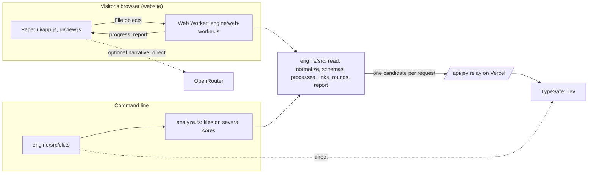

# Jevline: architecture

**Status:** experimental. Jevline turns one analyst-confirmed starting point into an incident, with Jev deciding what belongs to it. It is not a validated detector: a Jev score measures relatedness to the incident, not maliciousness, and every result needs review. See the [README](README.md) for use, and the [engine README](engine/README.md) for the engine in detail (input, links, rounds, questions, reproducibility, performance).

## One engine, two places

- **The same code.** `engine/src` is TypeScript with erasable syntax only. Node runs it as it is. The website publishes the modules the browser needs as JavaScript by erasing the types (`scripts/build_site.js`, using Node's own `stripTypeScriptTypes`), with no bundler, compiler or dependency.
- **Where Node and the browser differ.** File access is `files.ts` and `analyze.ts` (files, worker threads) in Node, and `browser.ts` (`File` objects read in chunks) in the browser. Everything after reading is `pipeline.ts`, the same in both. A test reads every test format through both paths and requires identical events. The build fails if a browser module imports anything from Node.
- **Results.** The report has the incident (members, each with how it joined and Jev's probability, identical repeats folded), the timeline (repeats of the same activity folded), the schemas learned, timings and Jev usage. The website shows it as the Incident, Event timeline, Execution chain and Evidence table tabs, and offers it as `report.json` with every exact Jev request as `requests.jsonl`.

## The website (Vercel)

`node scripts/build_site.js` assembles `_site/`: `site/index.html`, `ui/app.js`, `ui/view.js`, `ui/styles.css`, the engine modules under `engine/`, and the bundled example `examples/malicious_events.json`. Vercel serves it together with the functions `api/analyze.js` and `api/jev.js` (`vercel.json`).

- **Two ways to analyze.** With the site's free key the analysis runs on the server (`api/analyze.js`); with the visitor's own TypeSafe key it runs in the browser. Both run the same engine code.
- **The free key, on the server.** The page uploads the logs (at most 2 MB, as JSON text) and the function returns the loaded summary and seed list; to analyze, the page uploads them again with the starting point and context, and gets the report and the exact Jev requests back.
  - **No state.** Files, answers and results exist only in the request's memory. Nothing is stored and nothing about them is logged; `tests/test_analyze.js` fails if the function writes to the console. Learned schema mappings (field names and roles) go back to the browser, which keeps them and sends them with later uploads.
  - **The key can't be misused.** It only ever answers questions the server builds from uploaded logs: a script can make the site analyze up to 2 MB of logs, nothing else.
  - **Bounds:** 2 MB of logs per request, at most 2,000 Jev questions per analysis, 60 loads and 12 analyses per visitor address per hour, 200 analyses per hour across all visitors (per running instance). One investigation of CLA-WS-214 cost $0.03 to $0.11, so these cap the cost at a few dollars per hour per instance even under abuse. A Vercel Firewall rate-limit rule on `/api/analyze` makes it a hard limit across instances.
  - **The engine on Vercel:** the function erases the engine's TypeScript types once per instance (as the site build does) and imports it; `vercel.json` includes `engine/src` and allows 300 s.
- **Your own key, in the browser.** Files are read, normalized and linked in a Web Worker, so the page stays responsive on large files. Each Jev request goes to `/api/jev`, which forwards it with the visitor's key: `api.typesafe.ai` answers the browser's CORS preflight without `Access-Control-Allow-Origin` (checked October 2026), so a page can't call it directly.
  - The relay forwards only a Jev request as the engine builds it (the engine's model, 1 to 60 Noul or Choice questions, an analyst context of at most 500 characters), at most 256 KiB, 5,000 per visitor address per 10 minutes. Without a key it forwards nothing.
  - Its own refusals carry `"source": "relay"` and are shown as written; an unreachable TypeSafe returns 502/504, which the engine retries. It never logs or stores keys or bodies (`tests/test_relay.js`).
- **Connection policy.** The page and `vercel.json` set `default-src 'none'; script-src 'self'; style-src 'self'; img-src data:; connect-src 'self' https://openrouter.ai; base-uri 'none'; form-action 'none'` (plus `frame-ancestors 'none'` as a header). So the page, and the engine thread started from the site's own script, can contact only the site itself (the server analysis and the relay) and OpenRouter.
- **Keys in the page.** OpenRouter and own TypeSafe keys are typed into password fields and kept in page memory. **Remember on this device** stores them in that browser's `localStorage`; **Forget keys** clears both. Learned schema mappings (field names and roles, no data) are kept in `localStorage` so a log format is learned once per browser.
- **Narrative.** Optional. `ui/view.js` sends at most 60 timeline rows straight from the browser to OpenRouter (`credentials: 'omit'`, `referrerPolicy: 'no-referrer'`). Each row comes with how it belongs to the incident: the seed, the event that brought a member in (with Jev's probability and links), or later activity of a member. Rows are chosen with the seed's and members' joining events first. The reply is validated: event IDs must be ones that were sent, ATT&CK tactics must be one of the 14 Enterprise tactics, and technique IDs must look like `T1234` or `T1234.001`. Anything else is dropped. The drafted chain's unknown citations become `[unknown event]`.
- **Retrying.** The engine thread keeps every Jev answer of the session by request hash, so analyzing again after a failure reuses the answers already received.

## Data handling checklist

- Keep `.env`, run outputs and telemetry you aren't authorized to publish outside version control. The bundled lab export `examples/malicious_events.json` is the one intentional data file. Check every staged path before committing.
- A live run sends a summary of the starting point, each candidate and its links to TypeSafe (through the relay on the website). A narrative sends the selected timeline rows to OpenRouter. Only analyze telemetry you may share with them.
- Offline tests mock both providers; they don't measure Jev's accuracy: `npm test` from the repository root runs the relay, build, website and engine suites.

## Code map

| Path | Contents |
|---|---|
| `engine/src` | The engine; see the table in [engine/README.md](engine/README.md#development) |
| `site/index.html` | The website page: Jev access choice, key panel, privacy notice, connection policy |
| `ui/app.js` | The page: loading files into the engine thread, choosing the starting point, the result tabs, downloads |
| `ui/view.js` | What the page shows from a report: members, origins, evidence fields, the Jev-only chain, the OpenRouter narrative |
| `api/analyze.js`, `api/_analyze.js` | Server analysis with the site's free key: up to 2 MB of uploaded logs, nothing kept |
| `api/jev.js`, `api/_relay.js` | The Jev relay for visitors' own TypeSafe keys |
| `scripts/build_site.js`, `scripts/serve_site.js`, `vercel.json` | Website build (including the engine's browser modules), local preview with the relay, Vercel settings |
| `tests/`, `ui/test_site.js` | Relay, build and website tests |
| `examples/` | The bundled lab example: 100 Sysmon and Security records from the detonation of `2.8.exe` on CLA-WS-214 |

The original Python engine and local portal were replaced by this engine; they are in the git history up to the tag `python-engine-final`.
